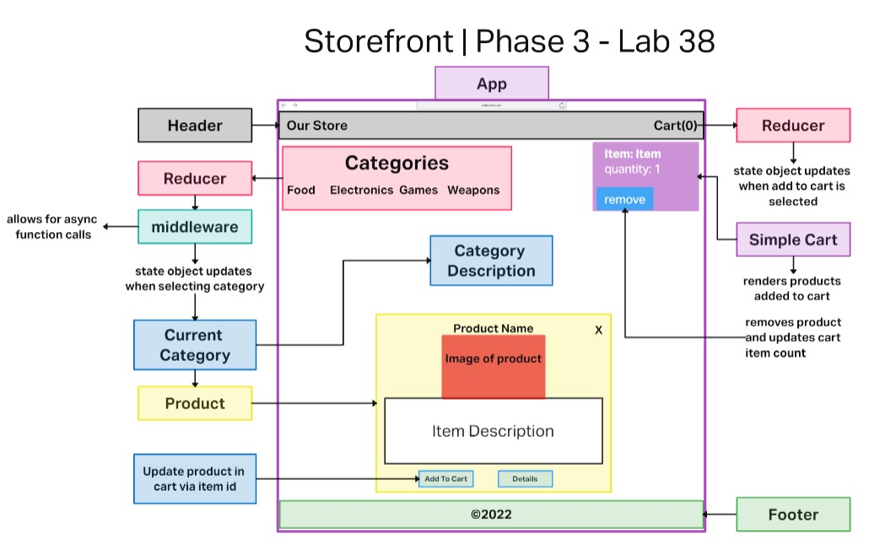
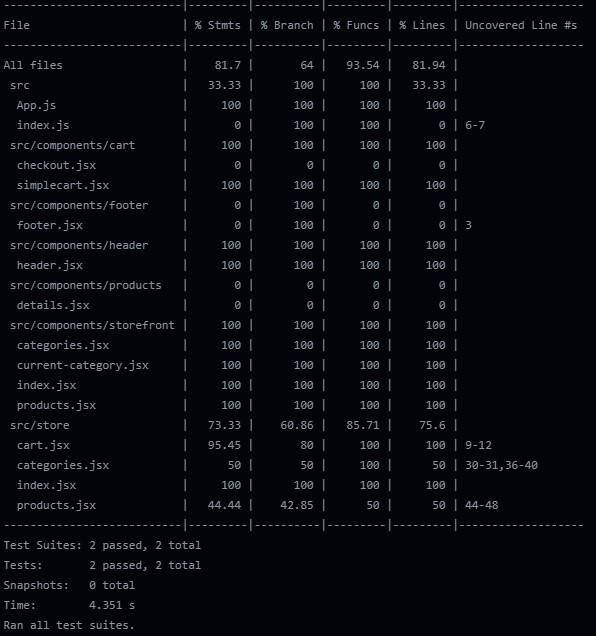
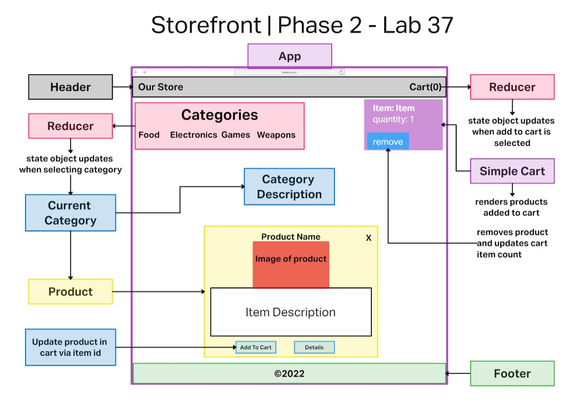
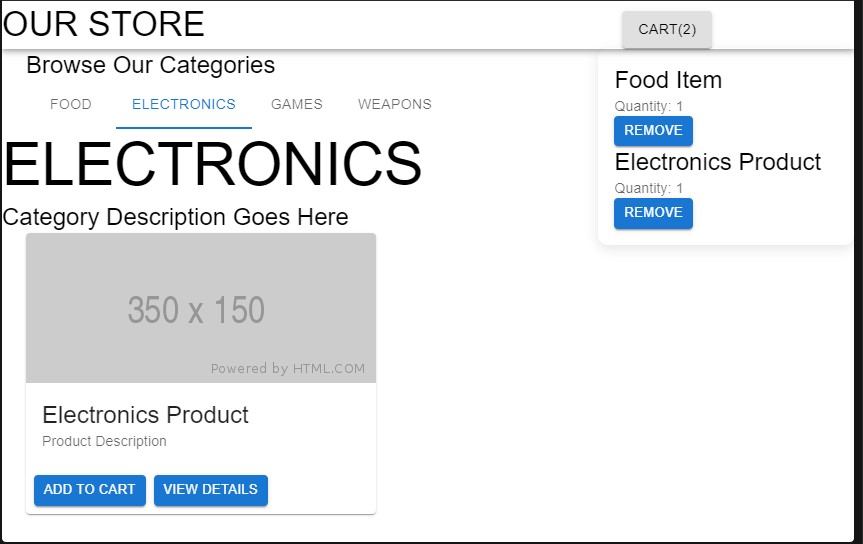
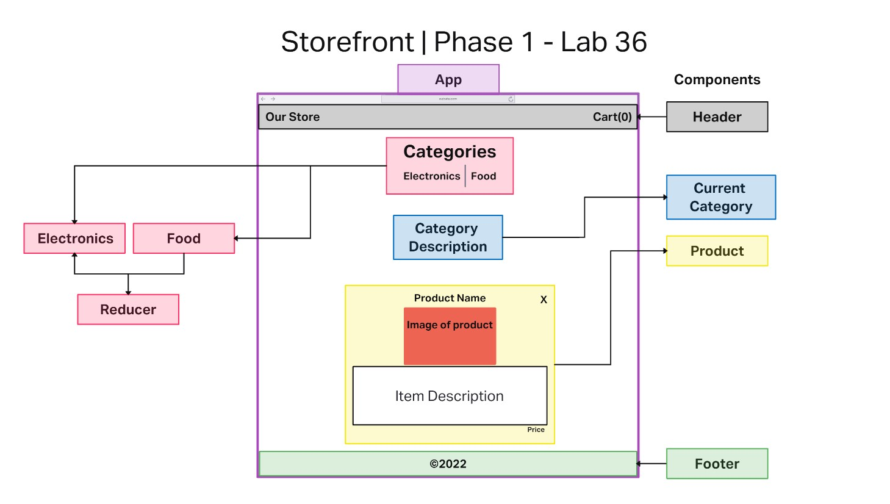

# Storefront App

## Author: Robert Ball

### An ecommerce storefront using React with Redux

Attribution:

[401d48 In class Demo](https://github.com/codefellows/seattle-code-javascript-401d48/tree/main/class-37/inclass-demo)

[401d50 Code Review](https://github.com/codefellows/seattle-javascript-401d50/tree/main/class-37/review/storefront)

---

Deployed Storefront on [Github Pages](https://rdball.github.io/storefront/)

### Phase 3 live on [codesandbox.io](https://codesandbox.io/p/github/RDBALL/storefront/lab38?file=%2Fsrc%2Fcomponents%2Fstorefront%2Fcategories.jsx&workspace=%257B%2522activeFileId%2522%253A%2522claag2bq7000ll0ggftji4a1b%2522%252C%2522openFiles%2522%253A%255B%255D%252C%2522sidebarPanel%2522%253A%2522EXPLORER%2522%252C%2522gitSidebarPanel%2522%253A%2522COMMIT%2522%252C%2522sidekickItems%2522%253A%255B%257B%2522key%2522%253A%2522claag2d6c0074356hd2jqojoe%2522%252C%2522type%2522%253A%2522PROJECT_SETUP%2522%252C%2522isMinimized%2522%253Afalse%257D%252C%257B%2522type%2522%253A%2522PREVIEW%2522%252C%2522taskId%2522%253A%2522start%2522%252C%2522port%2522%253A3000%252C%2522key%2522%253A%2522claag36ph00cx356hewd93o38%2522%252C%2522isMinimized%2522%253Afalse%257D%252C%257B%2522type%2522%253A%2522TASK_LOG%2522%252C%2522taskId%2522%253A%2522start%2522%252C%2522key%2522%253A%2522claag348700aw356hmlomfwy4%2522%252C%2522isMinimized%2522%253Afalse%257D%255D%257D)

### Phase 2 live on [codesandbox.io](https://codesandbox.io/p/github/RDBALL/storefront/lab37?workspace=%257B%2522activeFileId%2522%253Anull%252C%2522openFiles%2522%253A%255B%255D%252C%2522sidebarPanel%2522%253A%2522EXPLORER%2522%252C%2522gitSidebarPanel%2522%253A%2522COMMIT%2522%252C%2522sidekickItems%2522%253A%255B%257B%2522key%2522%253A%2522cla9b38jf0007356ivsr21n0d%2522%252C%2522type%2522%253A%2522PROJECT_SETUP%2522%252C%2522isMinimized%2522%253Afalse%257D%252C%257B%2522type%2522%253A%2522PREVIEW%2522%252C%2522taskId%2522%253A%2522start%2522%252C%2522port%2522%253A3000%252C%2522key%2522%253A%2522cla99rcqt00i7356h14npzgr0%2522%252C%2522isMinimized%2522%253Afalse%257D%252C%257B%2522type%2522%253A%2522TASK_LOG%2522%252C%2522taskId%2522%253A%2522start%2522%252C%2522key%2522%253A%2522cla99r8uv00g6356hk7vwpjar%2522%252C%2522isMinimized%2522%253Afalse%257D%255D%257D)

### Phase 1 live on [codesandbox.io](https://codesandbox.io/p/github/RDBALL/storefront/lab36?file=%2FREADME.md&workspace=%257B%2522activeFileId%2522%253A%2522cla7oen6w0012l3hvfjj7alyl%2522%252C%2522openFiles%2522%253A%255B%255D%252C%2522sidebarPanel%2522%253A%2522EXPLORER%2522%252C%2522gitSidebarPanel%2522%253A%2522COMMIT%2522%252C%2522sidekickItems%2522%253A%255B%257B%2522key%2522%253A%2522cla7oeoun000q356hxzyis4er%2522%252C%2522type%2522%253A%2522PROJECT_SETUP%2522%252C%2522isMinimized%2522%253Afalse%257D%255D%257D)

---

Documentation:

---

## Problem Domain

Our application will power an online storefront that will allow our users to browse our product offerings by category, place items in their shopping cart, and check-out when they are ready to make their purchase

---

## Phase 3

* In phase 3, we will be connect the virtual store to an API to retriece live data from tour data source. This will incororate `thunk` to be able to handle asynchronous actions throughout the application

---
Requirements:

* User Stories

  * > As a user, I want to interact with live inventory so that I have confidence that the displayed products are in stock

  * >As a user, I want to know to that when I add an item to my cart, that it is removed from inventory so that no other users can purchase it

---

## Phase 3 tests

## Phase 2

* In phase 2, we will be adding the “Add to Cart” feature to our application, which will allow our users to not only browse items in the store, but also select them and have them persist in their “shopping cart” for later purchase.

---
Requirements:

* User Stories

  * > As a user, I want to choose from products in the list and add them to my shopping cart

  * > As a user, I want to see the products that I’ve added to my shopping cart so that I know how many products I am purchasing

  * > As a user, I want to change the quantity of items I intend to purchase in my shopping cart

  * > As a user, I want to be able to remove an item from my shopping cart

---

### Phase 2 Render

---

## Phase 1

* In this first phase, our goal is to setup the basic scaffolding of the application with initial styling and basic behaviors. This initial build sets up the file structure and state management so that we can progressively build this application in a scalable manner

Requirements:

* Create a visually appealing site using Material UI
* Use a Redux Store to manage the state of categories and items in the store
* Display a list of categories from state
* When the user selects (clicks on) a category …
  * Identify that category as selected (change of class/display)
  * Show a list of products associated with the category

Phase 1 UML

